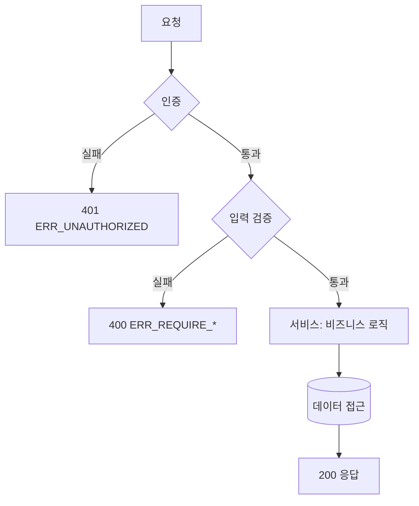

# API 플로우 문서 생성 (nova-api-flow)

특정 엔드포인트(또는 도메인의 엔드포인트 묶음)의 **실제 처리 흐름**을 추적해 문서화한다. **AI가 다음 작업에서 "이 요청이 코드에서 어떻게 흐르는지"를 즉시 파악**하게 한다.

## 출력 위치

`docs/api-flows/<엔드포인트-또는-도메인>.md` (REPO_ROOT 기준 — Nova 자산 sync 대상).

## 절차

1. 라우터에서 엔드포인트를 찾고, 호출하는 서비스→데이터 접근→외부 의존까지 실제 호출 체인을 따라간다.
2. 각 엔드포인트마다 아래를 작성한다.

## 엔드포인트별 템플릿

### `METHOD /path`
- **요약**: 한 줄.
- **인증/인가**: 의존성(예: `get_current_user` / `require_premium`)과 실패 시 상태.
- **플로우 다이어그램** (Mermaid `sequenceDiagram` 또는 `flowchart`): 진입 → 인증 → 입력검증 → 비즈니스 → 데이터접근 → 응답.

- **호출 체인**: `router.fn (파일:라인) → service.fn → repo/query`.
- **에러 분기**: 예외 4계층별 상태·에러코드 표.

## 규칙

- 코드 근거 `파일:라인` 필수. 추측 분기는 "❓"로 표기.
- 부수효과(이벤트 publish, 외부 호출, DB 쓰기)를 명시.
- 완료 후 한 줄 요약 + 관련 기능명세서 링크.
