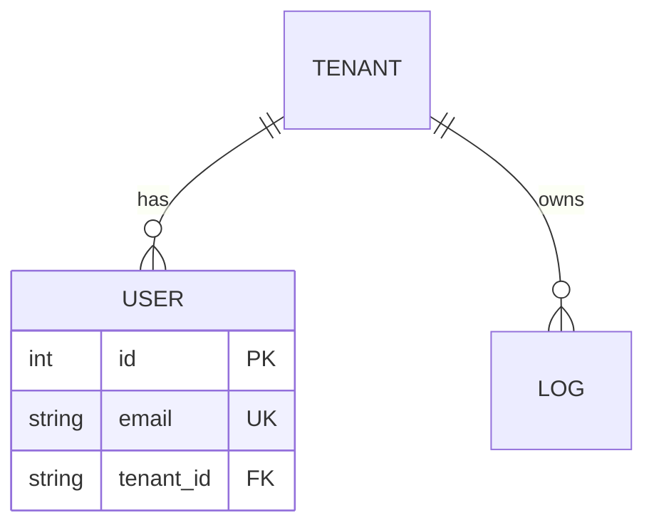

# DB 관계도 생성 (nova-db-erd)

데이터 모델을 코드에서 추출해 ERD + 테이블 사전을 만든다. **AI가 다음 작업에서 스키마를 정확히 참조**하게 하는 단일 진실의 원천.

## 출력 위치

`docs/architecture/erd.md` (REPO_ROOT 기준 — Nova 자산 sync 대상).

## 절차

1. 모델 정의를 찾는다: SQLAlchemy 모델(`models/`·`*_models.py`), Prisma `schema.prisma`, Django models, JPA Entity, 또는 마이그레이션(`alembic/`, `migrations/`).
2. 각 테이블의 컬럼·타입·PK/FK·UNIQUE·INDEX·기본값을 정확히 읽는다(추측 금지).
3. 아래를 생성한다.

## 필수 섹션

### 1) ERD (Mermaid)

- 관계 카디널리티(1:1, 1:N, N:M)를 FK 기준으로 정확히.

### 2) 테이블 사전
테이블마다 표: `컬럼 | 타입 | 제약(PK/FK/UK/NN) | 기본값 | 설명`.

### 3) 제약·인덱스 요약
UNIQUE 제약, 복합 인덱스, ON CONFLICT/CASCADE 정책.

## 규칙

- 모델 코드의 `파일:라인`을 근거로 표기.
- PG/SQLite 등 dialect 차이가 있으면 명시.
- N:M은 조인 테이블을 별도 표기.
- 완료 후 한 줄 요약.
